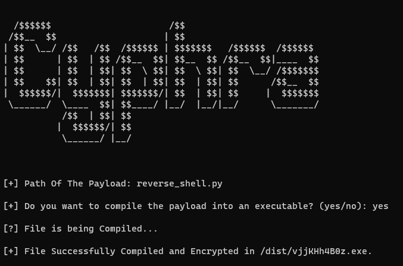

# Cyphra



Cyphra is a basic Python payload encoder designed to enhance the stealth and evasion capabilities of your payloads against most basic anti-virus software. By encrypting your Python payloads using a custom algorithm and generating random encryption keys, Cyphra significantly reduces the chances of detection by basic anti-virus scanners.

## Features

- Advanced Payload Encryption: Cyphra employs a custom encryption algorithm to securely encrypt Python payloads, ensuring a higher level of protection against anti-virus detection.
- Random Encryption Keys: The system generates random encryption keys, making it difficult for signature-based anti-virus solutions to identify and block the encrypted payloads.
- Optional Payload Compilation: Cyphra allows you to compile your encrypted payload into a standalone executable (.exe) for added convenience and portability.
- User-Friendly CLI: With an easy-to-use command-line interface, encrypting your payloads becomes a seamless process.
- Zero External Dependencies: Cyphra is designed to be self-contained, without the need for additional libraries or dependencies.

### Installation

Clone the Cyphra repository:

   ```bash
   https://github.com/breaching/Cyphra.git
   cd cyphra
   py Cyphra.py
   ```

If you find Cyphra useful, don't forget to give it a ⭐️!
